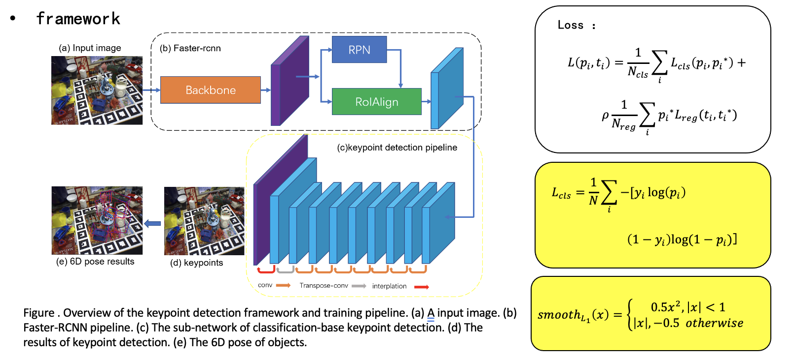
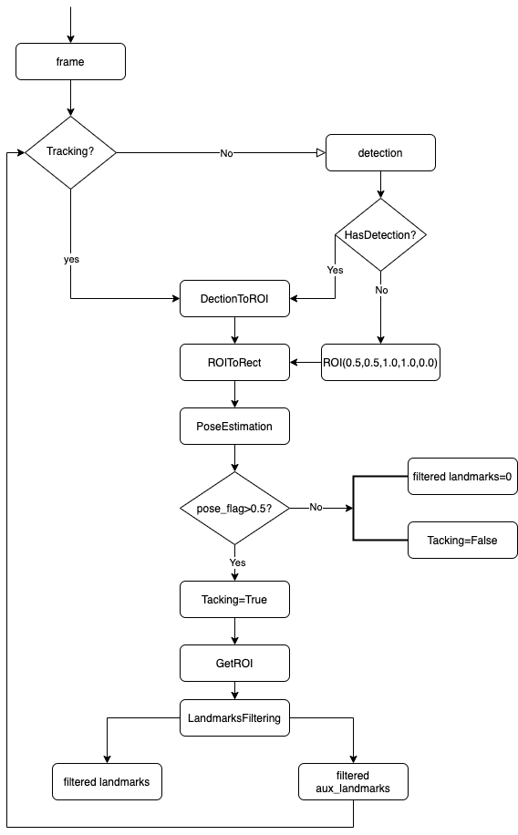
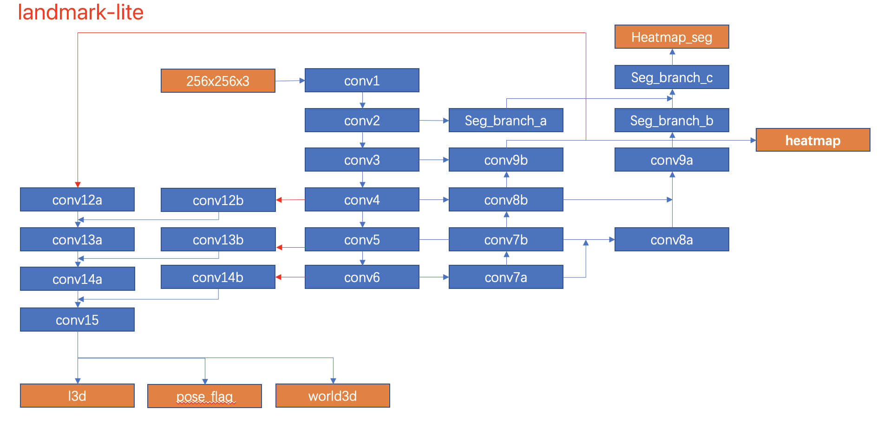
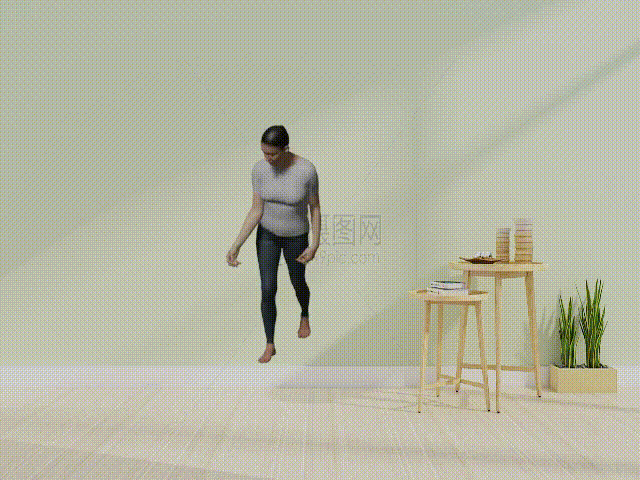
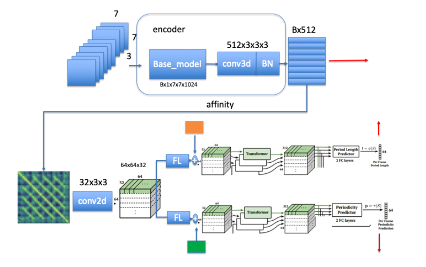
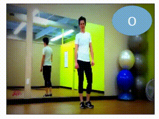
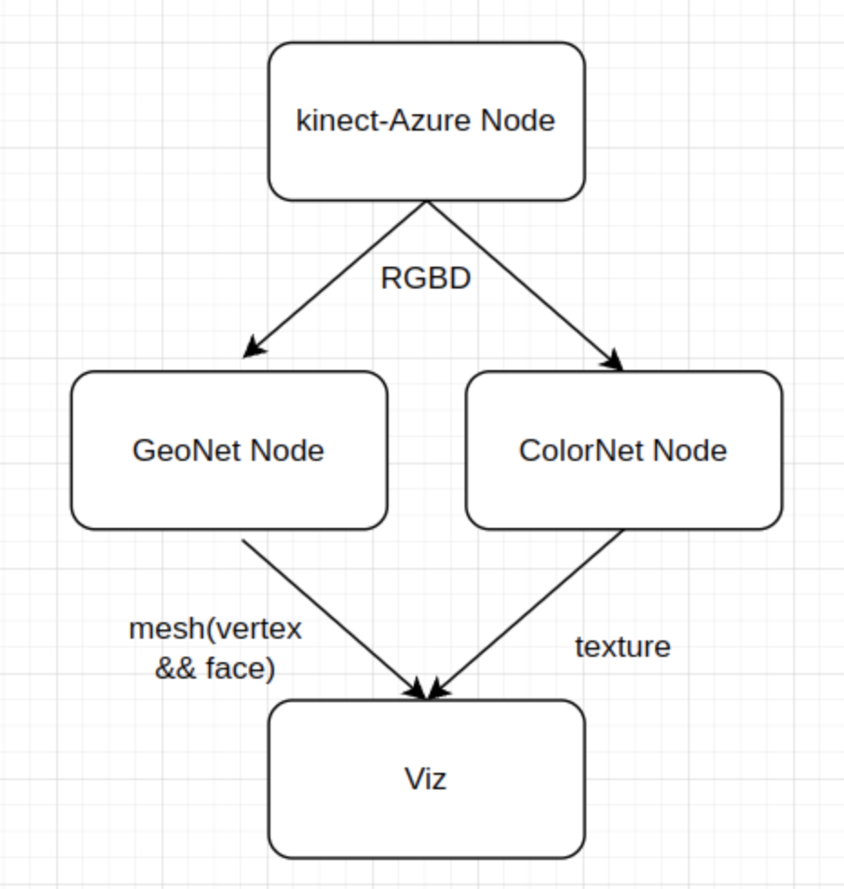

<!--
 * @Date: 2022-09-20 10:30:51
 * @LastEditors: cvhadessun
 * @LastEditTime: 2022-09-20 18:40:53
 * @FilePath: /PersonalProjects/README.md
-->
# PersonalProjects Page

## 1.EPNet[1]

A two-stage framework to obtain the high-precision pose of the multi-object,in which the first stage is the key point detection, and the second stage solves PnP to obtain the 6DoF pose. We propose a simpler and more efficient classification-based key point detection algorithm for key points on the object surface. Experiments show that the proposed method outperforms the SOTA methods and robust on the LINEMOD, Occlusion-LINEMOD, and YCB-Video datasets. Especially, we outperform the SOTA methods on the challenging Occluded-LINEMOD dataset by a large margin. Our approach is more robust to occlusion and more efficient to multi-object pose estimation task. The code will be available at: https://github.com/CvHadesSun/E2P.

## 2. Bazepose-Replementation

**BlazePose**[2], a lightweight convolutional neural network architecture for human pose estimation that is tailored for real-time inference on mobile devices. During inference, the network produces 33 body keypoints for a single person and runs at over 30 frames per second on a Pixel 2 phone. This makes it particularly suited to real-time use cases like fitness tracking and sign language recognition. Our main contributions include a novel body pose tracking solution and a lightweight body pose estimation neural network that uses both heatmaps and regression to keypoint coordinates.

|                     pipeline                     |                       network                        |
| :----------------------------------------------: | :--------------------------------------------------: |
|  |  |

[2] Bazarevsky V, Grishchenko I, Raveendran K, et al. Blazepose: On-device real-time body pose tracking[J]. arXiv preprint arXiv:2006.10204, 2020.

## 3. [PG-engine](https://github.com/CvHadesSun/PG-engine)
The engine to generate human pose dataset based on blender.(blender2.92 or higher).  Committed to  more reality human render engine. Support SMPL,SMPLX, and Self-designed model simulation and data generation, meanwhile support HDRI. Using camera array to capture whole Scene, and output the groundtruth labels: 2d/3d keypoints, occlusion info, camera parmerters, rgbd, pose and texture info, and etc.

**screen-shot**

## 3. RepCount

The application to count the periodic motion action,using two class method to implement: kNN classifier and DL. 

1. To do cycle motion count with **KNN classifier**:
    

2. **RPnet**:To do cycle motion count with DL

   | network                                                |                  vis                  |
   | ------------------------------------------------------ | :-----------------------------------: |
   |  |  |

## 4. [Human Avatar](https://github.com/CvHadesSun/Human-avatar)

The digital virtual human 

## 5. Multi-RGBD-PIFu

# Reference

[1] 

[2] 

[3] 
