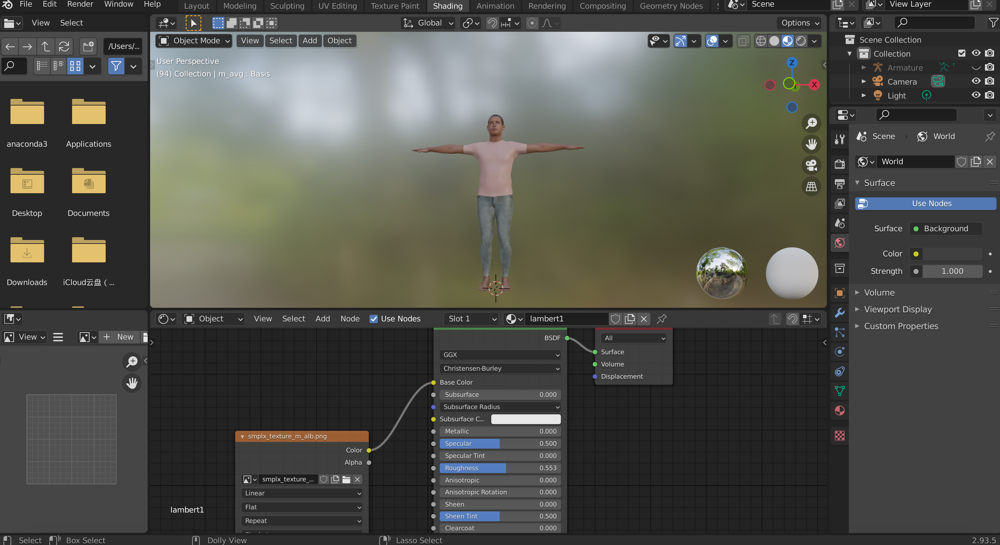
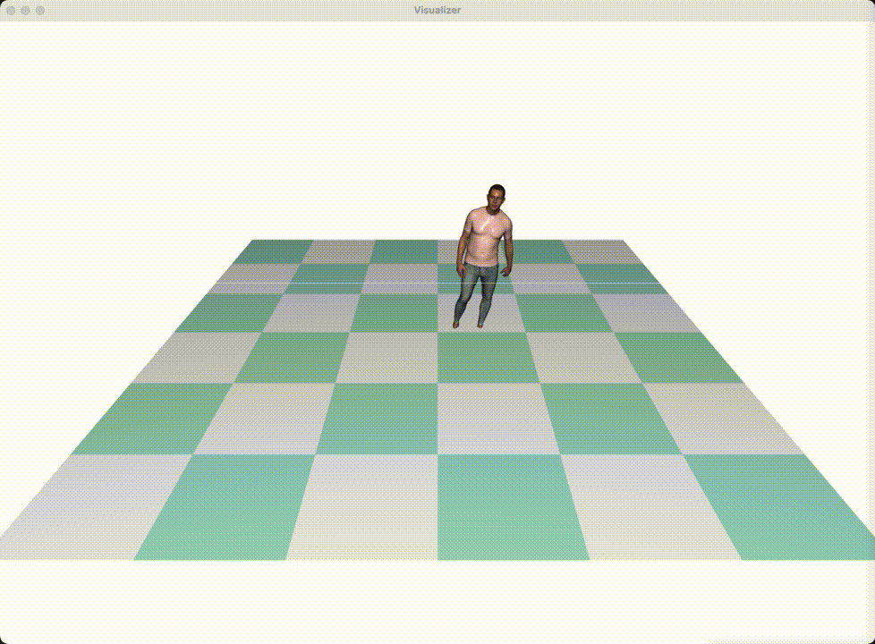
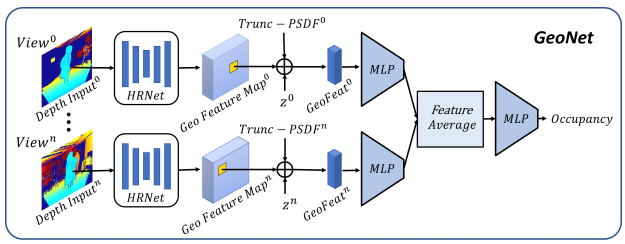
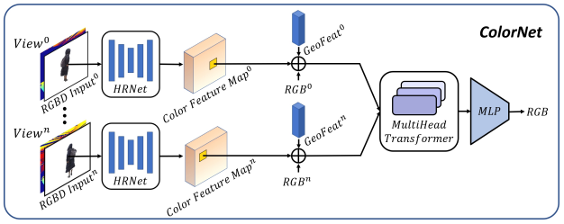
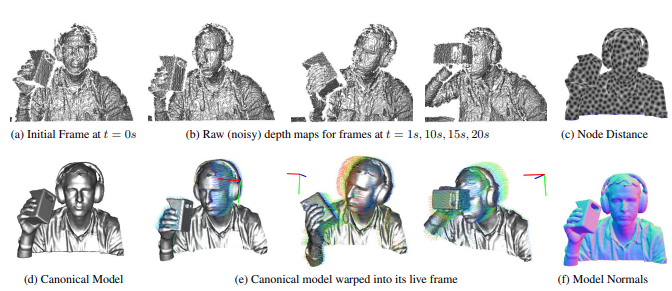
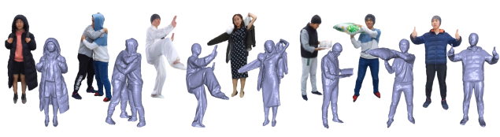

<!--
 * @Date: 2022-09-20 10:30:51
 * @LastEditors: cvhadessun
 * @LastEditTime: 2022-09-20 18:40:53
 * @FilePath: /PersonalProjects/README.md
-->
# PersonalProjects Page

## 1.[EPNet[1]](https://github.com/CvHadesSun/E2P)

A two-stage framework to obtain the high-precision pose of the multi-object,in which the first stage is the key point detection, and the second stage solves PnP to obtain the 6DoF pose. We propose a simpler and more efficient classification-based key point detection algorithm for key points on the object surface. Experiments show that the proposed method outperforms the SOTA methods and robust on the LINEMOD, Occlusion-LINEMOD, and YCB-Video datasets. Especially, we outperform the SOTA methods on the challenging Occluded-LINEMOD dataset by a large margin. Our approach is more robust to occlusion and more efficient to multi-object pose estimation task. The code will be available at: https://github.com/CvHadesSun/E2P.

## 2. Bazepose-Replementation

**BlazePose**[2], a lightweight convolutional neural network architecture for human pose estimation that is tailored for real-time inference on mobile devices. During inference, the network produces 33 body keypoints for a single person and runs at over 30 frames per second on a Pixel 2 phone. This makes it particularly suited to real-time use cases like fitness tracking and sign language recognition. Our main contributions include a novel body pose tracking solution and a lightweight body pose estimation neural network that uses both heatmaps and regression to keypoint coordinates.

|                     pipeline                     |                       network                        |
| :----------------------------------------------: | :--------------------------------------------------: |
|  |  |

## 3. [PG-engine](https://github.com/CvHadesSun/PG-engine)
The engine to generate human pose dataset based on blender.(blender2.92 or higher).  Committed to  more reality human render engine. Support SMPL,SMPLX, and Self-designed model simulation and data generation, meanwhile support HDRI. Using camera array to capture whole Scene, and output the groundtruth labels: 2d/3d keypoints, occlusion info, camera parmerters, rgbd, pose and texture info, and etc.

**screen-shot**

## 3. RepCount

The application to count the periodic motion action,using two class method to implement: kNN classifier and DL. 

1. To do cycle motion count with **KNN classifier**:
    

2. **RPnet** [3]:To do cycle motion count with DL (**contribution: And re-struct the  similarity** **matrix for transformer input.**)

   We present an approach for estimating the period with which an action is repeated in a video. The crux of the approach lies in constraining the period prediction module to use temporal self-similarity as an intermediate representation bottleneck that allows generalization to unseen repetitions in videos in the wild. We train this model, called RepNet, with a synthetic dataset that is generated from a large unlabeled video collection by sampling short clips of varying lengths and repeating them with different periods and counts. This combination of synthetic data and a powerful yet constrained model, allows us to predict periods in a class-agnostic fashion. Our model substantially exceeds the state of the art performance on existing periodicity (PERTUBE) and repetition counting (QUVA) benchmarks. We also collect a new challenging dataset called Countix (∼90 times larger than existing datasets) which captures the challenges of repetition counting in real-world videos. Project webpage: https://sites.google.com/view/repnet. 

   | network                                                |                  vis                  |
   | ------------------------------------------------------ | :-----------------------------------: |
   |  |  |

## 4. [Human Avatar](https://github.com/CvHadesSun/Human-avatar)

The digital virtual human demo based on open3d, which can support the action and voice interaction. The demo can collect the voice command and recognize the voice contants and react the about action, and meanwhile yeild the answer. The demo contains the human body reconstruction ,high face reconstruction based no SMPLX and FlAME parameter model from RGB picture, at the same time, convert the FLAME texture into SMPLX face and fusion with SMPX model texture figure. This project is based on another self-project : [3D-tools](https://github.com/CvHadesSun/3D-Tools/tree/main/vis), a 3d visualization online toolkit.

## 5. Multi-RGBD-PIFu

We recurrent the PIFu [4]  based on the offical source code, we  implement Function4D[5] a tiny-network to predict the surface of digital human in time. And we train the network with Thuman2.0 dataset, render the dataset into multi-view RGBD image by perspective mode, and add the kinect-pattern noise into image for real multi-view kinect sensor access into system.

## 6. DynamicFusion[5] recurrent

coming soon.

## 7. Function4D[6] recurrent

Base on Dynamic fusion and multi-view PIfu project, re-implement the Function4D project: using 3-view kinect azure sensor to capture the real-sence RGBD image , and by non-rigid tack and reconstruction , re-render the de-noised RGBD image for RGBD-PIFu, finally reconstruction high quality digital model, in order to implement this pipeline can reconstruct the avatar in time, using ROS to build whole system: about data capture, non-rigid tack and deformation, implicit 3D reconstruction, and render displayer. To quantify the nerual network weight, using mixed precision to boost the computing efficiency.

# Reference

[1]  **Sun W**, Zhou M, Zhang S. EP-Net: More Efficient Pose Estimation Network with the Classification-based Key-points Detection[C]//2020 2nd International Conference on Video, Signal and Image Processing. 2020: 100-108.

[2]  Bazarevsky V, Grishchenko I, Raveendran K, et al. Blazepose: On-device real-time body pose tracking[J]. arXiv preprint arXiv:2006.10204, 2020.

[3] Dwibedi D, Aytar Y, Tompson J, et al. Counting out time: Class agnostic video repetition counting in the wild[C]//Proceedings of the IEEE/CVF conference on computer vision and pattern recognition. 2020: 10387-10396.

[4] Saito S, Huang Z, Natsume R, et al. Pifu: Pixel-aligned implicit function for high-resolution clothed human digitization[C]//Proceedings of the IEEE/CVF International Conference on Computer Vision. 2019: 2304-2314.

[5] Newcombe R A, Fox D, Seitz S M. Dynamicfusion: Reconstruction and tracking of non-rigid scenes in real-time[C]//Proceedings of the IEEE conference on computer vision and pattern recognition. 2015: 343-352.

[6] Yu T, Zheng Z, Guo K, et al. Function4d: Real-time human volumetric capture from very sparse consumer rgbd sensors[C]//Proceedings of the IEEE/CVF Conference on Computer Vision and Pattern Recognition. 2021: 5746-5756.
